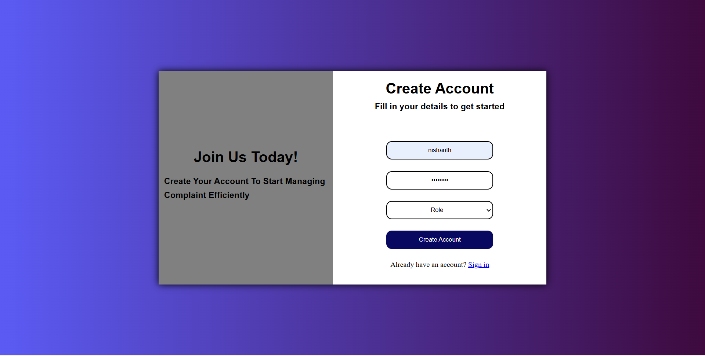
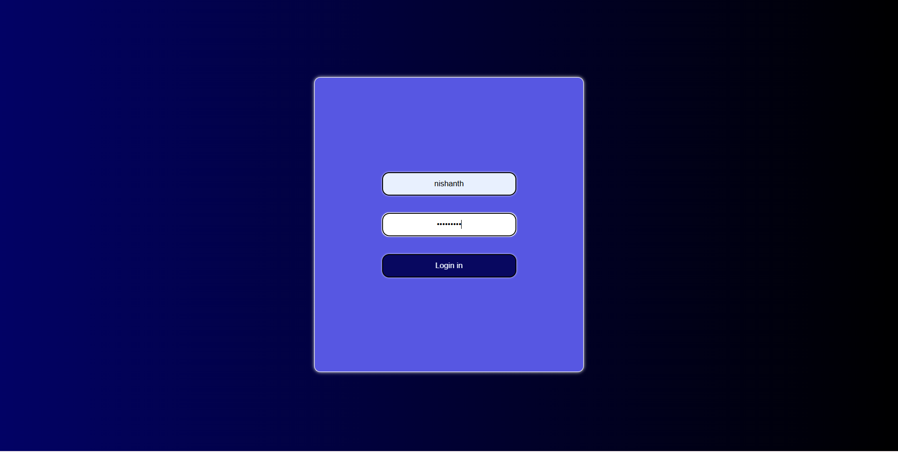

# 📌 Complaint Management System (Basic)

## 🚀 Project Overview

This is a simple **Complaint Management System UI** built using:

* HTML
* CSS
* JavaScript (localStorage)

It allows users to:

* Create an account (Signup)
* Login using stored credentials

---

## 🖼️ Project Screenshots

### 🔹 Signup Page

### 🔹 Login Page

---

## 📂 Project Structure

project-folder/
│
├── signup.html
├── login-page.html
├── README.md
├── createaccout-image.png
└── loginaccount-image.png

---

## ✨ Features

* User Signup with:
  * Username
  * Password
  * Role selection
* Login Authentication
* Data stored using **localStorage**
* Simple and clean UI design
* Responsive layout

---

## ⚙️ How It Works

### 🔹 Signup

* User enters details
* Data is stored in browser localStorage

### 🔹 Login

* User enters username & password
* System checks stored data
* If correct → redirect to dashboard

---

## ⚠️ Limitations

* Stores only one user (overwrites previous data)
* No backend (data stored only in browser)
* Not secure (for learning purpose only)

---

## 🧠 Future Improvements

* Store multiple users
* Add database (Firebase / MySQL)
* Password encryption
* Dashboard functionality
* Role-based access system

---

## 💡 Author

👨‍💻 Developed by **Nishanth**

---

## ⭐ Support

If you like this project:

* Give it a ⭐ on GitHub
* Share with your friends